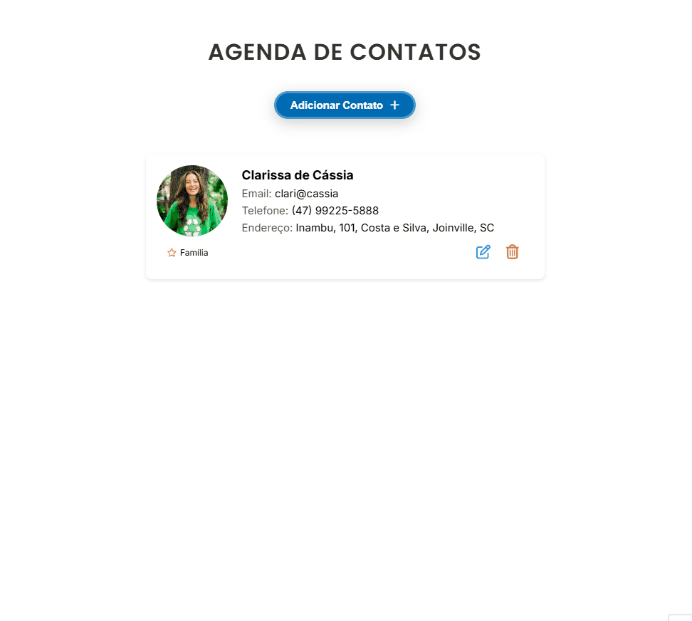

<h1 align="center" fontSize="60px">
 Agenda de Contatos
</p>

<p align="center">
  
</p>


## 💻 Projeto

Agenda de Contatos é uma aplicação simples e intuitiva para armazenar e gerenciar contatos. Ela permite adicionar, visualizar, editar e excluir contatos de maneira prática e eficiente. O frontend foi construído com Vue.js, garantindo uma interface dinâmica e responsiva para uma melhor experiência do usuário.

A aplicação facilita o gerenciamento de contatos, permitindo armazenar e buscar informações essenciais, como nome, telefone, e-mail, endereço, além de classificar os contatos por categorias. 

<h2>⚙️ Funcionalidades</h2>
<p>✔ <strong>Adicionar contato</strong>: Cadastrar um novo contato com nome, telefone e e-mail.</p>
<p>✔ <strong>Listar contatos</strong>: Exibir todos os contatos cadastrados de forma organizada.</p>
<p>✔ <strong>Editar contato</strong>: Atualizar as informações de um contato existente.</p>
<p>✔ <strong>Excluir contato</strong>: Remover um contato da agenda.</p>
<p>✔ <strong>Pesquisar contato</strong>: Buscar um contato pelo nome ou pela categoria.</p>
<p>✔ <strong>Mensagens de feedback</strong>: Exibir alertas para ações realizadas, como sucesso ao cadastrar ou erro ao tentar excluir um contato inexistente.</p>

## 🛠️ Ferramentas Utilizadas

<h3>Frontend</h3>

-  [Vue.js](https://vuejs.org/) 
-  [Axios](https://axios-http.com/ptbr/docs/intro)
-  [CSS](https://developer.mozilla.org/pt-BR/docs/Web/CSS)

## 📥 Passo a Passo para Instalação e Execução
**Pré-requisitos:**
- Visual Studio Code
- Node.js (Para rodar o frontend)
- Git

### 1️⃣ Clonar o Repositório

   ```bash
  git clone https://github.com/SEU-USUARIO/agenda-simples.git   
